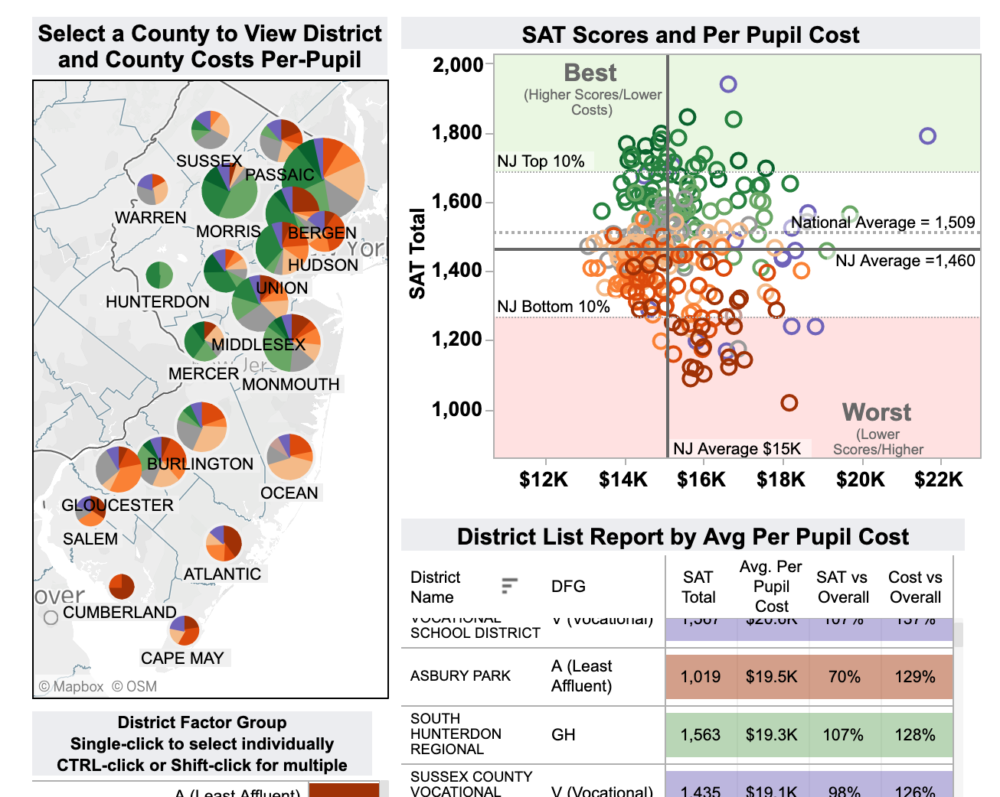
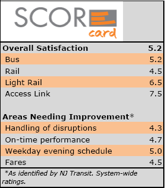

# The Lovely Garden State: Interactive Web Dashboard

## Summary

We have created a map with an interactive dashboard for families looking to move to or within NJ that provides the user important information about a county that is easy to understand. The information includes school performance information, hospital rankings, and income information.

## Group Members

* Arjun Subramaniam
* Smita Sharma
* Mike Lygas
* Gretel Uptegrove

## Motivation

A friend is looking for a place to live in New Jersey and was overwhelmed with the decision-making process. We developed a tool that provides comparison location by county for select information important for families. This tool would narrow down the area to further explore by county.

### Visualization Examples for Inspiration

## Sources

* Household Income Information [Census FactFinder](https://factfinder.census.gov/faces/nav/jsf/pages/index.xhtml)
  * Used income from 2017 based on the American Community Survey 5-Year Estimates.

* New Jersey School Performance Reports from [New Jersey Department of Education](https://rc.doe.state.nj.us/ReportsDatabase.aspx)
  * Performance data for schools administered by NJ Department of Education.
  * Utilized SAT scores for 2017-2018 school year from [The College Board](https://collegereadiness.collegeboard.org/pdf/understanding-sat-scores.pdf)
* Hospital Rating Data from [Medicare](https://data.medicare.gov/Hospital-Compare/Hospital-General-Information/xubh-q36u)
  * Includes a list of all hospitals that have been registered with Medicare
  * Utilized hospital ratings from this dataset.
    * Rating is assigned by Medicare on a scale of 1-5.

* New Jersey GeoJson Data[State of New Jersey - GIS Open Data](https://njogis-newjersey.opendata.arcgis.com)
  * Used Spatial representation of counties to create county layer in mapbox.
  * Used location GeoJson data for schools in NJ to match schools to counties.

## Workflow

### Step 1: Extract Data

* Downloaded data as csv or excel files from Medicare, NJ Department of Education, the College Board and from the Census Bureau.
* Downloaded geoJson datasets from State of New Jersey - GIS Open Data.

### Step 2: Clean Data and Enter into Database

* Developed cleaning code for csv and excel files utilizing jupyter notebook and then exported into python files.
  * Dropped hospitals with unavailable data - this may skew rating results as there are not many hospitals in each county; however we feel the information provided would still be useful.
  * Calculated rank by income for each County.
* Created dictionary for mapping SAT data.
* Developed python code for extracting desired data from geoJson dataset for New Jersey schools.
* Converted separate files into functions in python program clean.py that cleans the data and enters them into a SQL database.
* Developed primary python file app.py that calls functions from clean.py and sets up Flask routes for rendering data.

### Step 3: Render Data

* HTML & CSS Files
  * index.html: Used to setup the webpage where data will be rendered
  * style.css: css file used to style the webpage.

* Javascript Files:
  * logic.js: Primary javascript file that sets up map and connects functions that create visualizations to map actions.
  * config.js: Stores the API key for mapbox.
  * visual.js: Comprised of functions that build the visualizations called in logic.js.

  Javascript Packages used:
  * Mapbox
  * Leaflet
  * d3
  * jQuery
  * Plotly

## System Requirements

* Chrome Web Browser
* Python environment running Python 3.7

## Steps to run the application

1. Run: `pip install -r requirements.txt` to install necessary modules in environment.
2. Run SQL Database Server on local computer.
3. An API key for MapBox is required. These can be obtained at <https://docs.mapbox.com/help/glossary/access-token/>. After obtaining a key, copy that key into the config.js file.
4. Run `app.py`.
5. Access application at <http://localhost:8000/>.
